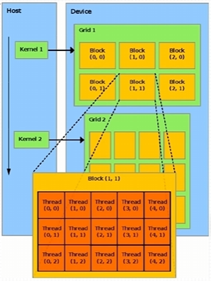
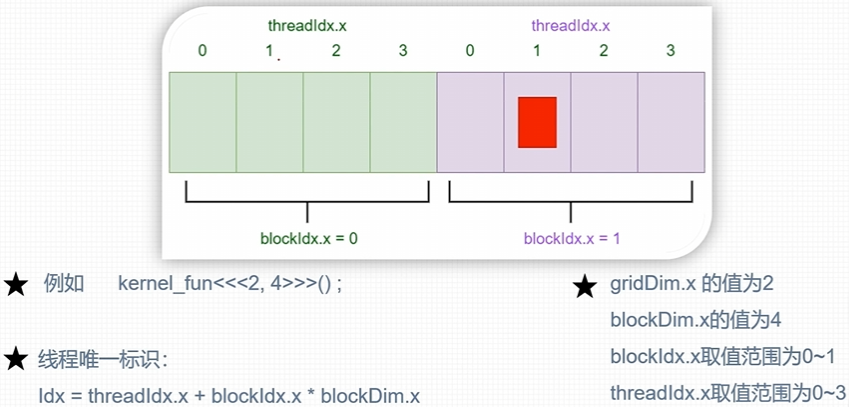
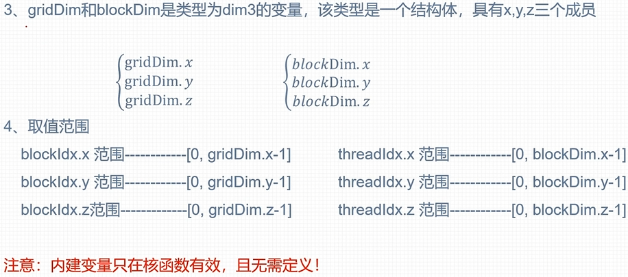
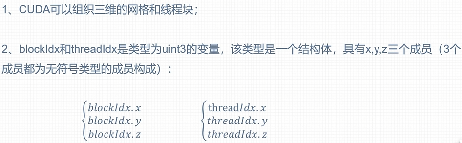

# CUDA

## kernel_func

1. 其在GPU上并行执行，无需显示进行线程编写等操作
2. 核函数需要限定词`__global__`修饰(还有其他限定词)
3. 返回值为void

```cpp
__global__ void kernel_func(argument arg)
{
    // code here
}
```

> 核函数(以下简称k_f)只能访问**GPU内存**  
> k_f不能使用**变长参数**、**静态变量**、**函数指针**  
> k_f具有**异步性**：CPU调用k_f启动核函数执行，但不会等待k_f执行完毕，因此需要用到cpu与gpu**同步**(❗重要❗)  
> k_f不支持`<iostream>`

```cpp
#include <stdio.h>

__global__ void hello()
{
    printf("hello cuda\n");
}

int main()
{
    hello<<<4, 4>>>();  // 第一个4表示线程块的数量(上限1024,0~2^23-1)
    // 第二个4表示每个线程块线程的数量，此处一共16线程

    cudaDeviceSynchronize();  // 同步cpu与gpu，刷新核函数运行结果
    return 0;
}
```

## 线程模型结构

> 图中呈现的仅仅是逻辑上分块，实际物理上是没有分块的。

  
上图中**Host**指在cpu中执行的逻辑，**Device**指gpu运行部分  
**Grid1**指核函数kernel1指定的线程块数量(上限1024,0~2^23-1)，其中的**block**指包含的线程数量

### 一维线程模型(有一维当然有多维😤)

> **gridDim blockDim blockidx threadidx**
> **❗注意**：向右为x维度增加的方向，向下为y维度增加的方向，且**x为第一维度**向👉，**y为第二维度**向👇，**z为第三维度**向👊，下注意看上图中各维度随着各个方向的变化情况(维度**1**向右增长，维度**2**向下增长)。

1. 每个线程在核函数中都有唯一标识，其标识由**grid_size, block_size**唯一确定。  
而这两个值保存在**内建变量(build-in variable)**：`gridDim.x & blockDim.x`中。
> 👉内建变量指不用声明，直接可以使用的变量。

2. 而需要索引线程的时候，可根据内建变量`blockidx.x & threadidx.x`进行索引，它们取值范围分别是：`blockidx.x`: `0~gridDim.x-1`, `threadidx.x`:`0~blockDim.x-1`  
如下图所示👇  


```cpp
__global__ void kernel_func()
{
    // code here
}

int main()
{
    // 线程的唯一标识由grid_size, block_size确定👇
    kernel_func<<<grid_size, block_size>>>();
    return 0;
}
```

### 多维线程(最多三维)

👇  **dim3**
  
👇  **uint3**
  
如何定义多维的grid_size与block_size🤔(使用):  
> use `uint3 & dim3`,未声明的变量默认为`1`

```cpp
dim3 grid_size(2,2);  // 等价于dim3 grid_size(2,2,1)，means 2*2 blocks 形成一个2*2 block matrix，在x与y方向均有两个并行度
dim3 block_size(5,3);  // 等价于dim3 block_size(5,3,1)，means 5*3 blocks 形成一个3*5 block matrix，在x与y方向分别有5&3个并行度
//❗👇
// 如何确定threadid的全局索引：
int globalIdx = threadIdx.x + blockIdx.x * blockDim.x;  // 确定全局idx
int globalIdy = threadIdx.y + blockIdx.y * blockDim.y;  // 确定全局idy
int globalIdz = threadIdx.z + blockIdx.z * blockDim.z;  // 确定全局idz  这三项的求解不会相互影响

int gridOffset = gridDim.x * gridDim.y * blockDim.x * blockDim.y;  // 每个grid的偏移量
int globalId = globalIdx + globalIdy * blockDim.x * gridDim.x + globalIdz * gridOffset;  // 全局索引

// 按照grid👉blockid👉threadid来确定
int globalId = (gridDim.x * gridDim.y * blockIdx.z + gridDim.x * blockIdx.y + blockIdx.x) * (blockDim.x * blockDim.y * blockDim.z) + blockDim.x * blockDim.y * threadIdx. z + blockDim.x * threadIdx.y + threadIdx.x
```
